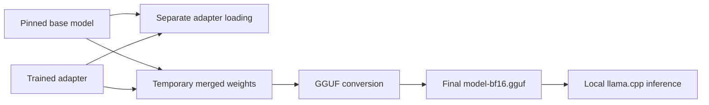

# Inference with ProxyType-4B

Inference means generating an answer from a model.
The supported task takes one marked voting target with its source context.
Prepare the fragment through the [dataset workflow](dataset.md).
The model returns the fourteen-field [label contract](label-contract.md).
It does not select every target in a complete filing.
Complete the [preparation stage](training.md#preparation-stage-before-gpu-work) in the root `.venv/` before the user launches GPU work.

## Model formats

An adapter stores learned changes to the base weights.
Merging applies those changes to a copy of the base weights.
GGUF is the converted model format used by llama.cpp.
These are separate steps with different storage and runtime requirements.



| Form | Required files and tradeoffs |
|---|---|
| Separate adapter | About 82 MiB with tokenizer files, plus the matching external base weights. The adapter can be replaced independently. |
| Temporary merged model | About 7.9 GiB of base weights with adapter changes applied. Conversion needs temporary disk space and a compatible Python environment. |
| Final GGUF | About 7.9 GiB with its tokenizer information. The supported llama.cpp path needs no separate base weights or adapter loading. |

The Python input renderer uses the retained tokenizer files to preserve exact prompt tokens.
The GGUF also contains tokenizer information for its runtime.
Keep no duplicate merged-weight or tokenizer directories without a supported caller.
Delete temporary merged weights after successful conversion.

Merging removes separate adapter calculations.
Changing to llama.cpp also changes the inference engine and its GPU implementation.
Do not attribute every speed difference to merging or promise identical answers across formats.
The project publishes no timing or accuracy claim from deleted experiment reports.

## External runtime

The recorded engine revision is `329b6160f513915f1c607dbfae3d5ce864a64a4f`, release `b10909-mix-bea84f7`.
Keep its executable, required shared libraries, build information, notices, and runtime manifest in an external installation.
The retained build uses CUDA 12.8 and x64 Linux.
The current supported installation uses external CUDA 12 libraries and its own OpenMP library.
It does not depend on a Torch library inside a deleted experiment environment.

```bash
export PROXYBENCH_RUNTIME="$HOME/.local/share/proxybench/runtime/llama-329b6160"
export PROXYBENCH_CUDA_LIB="/usr/local/lib/ollama/cuda_v12"
.venv/bin/python -m proxybench infer --help
```

[configs/inference.json](../configs/inference.json) records the engine controls and runtime variables.
Preserve the exact revision and dependency identities when installing another supported runtime.
A new build needs bounded loading and inference tests before replacing the tested installation.
Keep installed environments and model caches outside run folders.

## Inputs and answers

Use the exact [system prompt](../configs/model-system-prompt.txt).
Save source context as UTF-8 text in `fragment.txt`, with one `BEGIN MARKED TARGET` and `END MARKED TARGET` pair.
The command places this context in the user message without repeating the label policy.
Preserve the generation prefix, tokenizer template, response parameters, and token limits.
The server must not substitute another chat template.

```bash
.venv/bin/python -m proxybench infer --model artifacts/models/ProxyType-4B/model-bf16.gguf --input fragment.txt --config configs/inference.json --run-dir ../proxybench-runs/inference-001
```

The command saves the raw answer before parsing or normalization.
Keep failure details when generation times out or the answer violates the contract.
Do not silently repair malformed answers or infer unsupported values.
Inference binds its server to `127.0.0.1` and stops its owned process after work.
Keep process, memory, and input limits enabled.

For separate adapter loading and temporary conversion, use `.venv/bin/python -m proxybench export --help`.
The loader fetches the declared base revision and applies the local Safetensors adapter.
The adapter configuration alone is not proof that the correct revision loaded.
Use the bounded acceptance tests in the [training guide](training.md) before deleting working originals.
