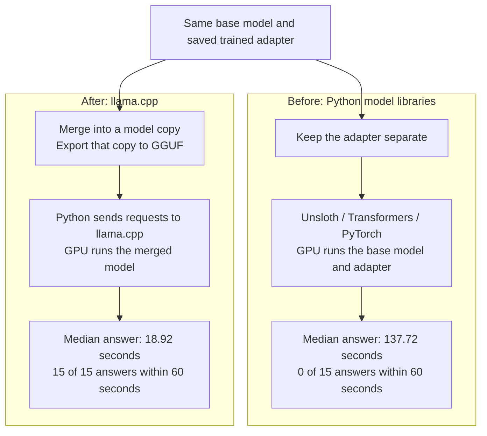

# Faster inference with Qwen3.5-4B

Inference means generating answers with a trained model.
In our 2026-09-15 test, median answer time fell from 137.72 seconds to 18.92 seconds, about 7.3 times faster.
We achieved this by merging the trained adapter into a model copy and running that copy through llama.cpp.
Both methods used the same RTX 3090 GPU and the same 15 development examples.

An adapter stores the small weight adjustments learned during training.
Merging folds those adjustments into the base model weights.
GGUF is a model file format used by llama.cpp.
The original model and saved adapter remained separate from the merged copy.

## Before and after

The diagram compares two ways to run the same trained model.
Merge and export happen before answer generation.
The times below measure complete answers with the model already loaded.

Before optimization, Python libraries called GPU operations and applied the adapter adjustment separately at each affected layer.
After optimization, Python prepared requests and recorded responses, while llama.cpp controlled model execution with the adjustments already merged.
Python itself ran on the CPU in both methods.
The GPU performed the heavy model calculations in both methods.

## What changed

We saved the adapter immediately after the authorized 30 training steps and restored it in a fresh process.
The restored adapter matched the saved values and reproduced three complete answers exactly.
This gave both methods the same saved training result for comparison.

We then merged the adapter into a disposable copy of the model.
That removed the separate adapter calculations during generation.
Merging improved short Python timing probes, but the first complete merged Python answer still exceeded the 60-second limit.

We exported the merged model to GGUF and loaded it into a dedicated llama.cpp server.
The export retained BF16 model weights and F32 auxiliary values.
BF16 and F32 store numbers with 16 and 32 bits.
All 426 converted arrays matched the converter's expected transformations.
The successful engine test used this export without further training.

## How this fits the usual workflow

LoRA trains adapters while keeping base weights fixed.
[Hugging Face's LoRA guide](https://huggingface.co/docs/peft/v0.21.0/package_reference/lora) documents merging as a way to remove the extra adapter calculations during inference.
[Unsloth's export guide](https://unsloth.ai/docs/basics/inference-and-deployment/saving-to-gguf) documents saving a merged model for use with llama.cpp.

These are established deployment options, and neither merging nor llama.cpp is required for every fine-tuned model.
In our project, we resolved converter and library compatibility issues, preserved the trained model, and compared complete answers on the same inputs.
The 15-case comparison found no new reviewed errors from the engine, while existing extraction errors remained.

## Where CUDA fits

CUDA is NVIDIA's software platform for GPU computation.
A kernel is a small program executed on the GPU.
The Python method already used CUDA through PyTorch and other installed libraries.
The faster method used llama.cpp's own CUDA kernels, with all 33 reported model layers on the GPU.
We wrote no custom CUDA kernels for this experiment.

The server enabled Flash Attention, an optimized attention calculation.
Its build also included support for CUDA graphs, which group GPU operations for repeated execution.
We did not measure either feature's separate contribution to the speedup.
The result compares the complete software methods and does not isolate Python overhead or a single GPU operation.

The [server configuration](../configs/qwen35-4b-llama.json) records the measured controls.
The engine was release `b10909-mix-bea84f7`, at source commit `329b6160f513915f1c607dbfae3d5ce864a64a4f`.
The test used one local server and one active request at a time.

## Measured result

Both methods received identical prompt token sequences and the complete source context.
A token is a piece of text processed by the model.
Each measured answer followed a separate warmup and started without reused work from earlier requests.
The methods used the same answer allowance and chose the highest-scoring next token without random sampling.

| Measure across 15 examples | Python with separate adapter | Merged llama.cpp |
|---|---:|---:|
| Median complete-answer time | 137.72 seconds | 18.92 seconds |
| Complete-answer range | 118.24 to 175.10 seconds | 16.29 to 20.65 seconds |
| Median first-token delay | 0.605 seconds | 0.680 seconds |
| Answers within 60 seconds | 0 of 15 | 15 of 15 |
| Answers passing the format contract | 15 of 15 | 15 of 15 |

The speed gain occurred during production of the answer after its first token.
Fourteen parsed engine answers matched Python exactly.
The remaining answer used a shorter source excerpt with the same supported meaning.
Source review found no new errors introduced by the engine.

The timing includes prompt processing and response capture, but excludes model loading and the separate warmups.
Python also included final decoding and format parsing before recording elapsed time.
The engine client recorded elapsed time before those final steps.
The experiment did not isolate the cost of that timing difference.

## Limits and reuse

Both methods retained four source-value errors and four origin errors, with nine answers free of either reviewed error type.
An origin annotation states whether information was extracted or derived.
All 15 examples were training and development data, so this result does not establish accuracy on new filings.
The full experiment stayed within its resource limits and preserved the labels, original model files, and previous artifacts.

For a later trained adapter, the same sequence applies: save, restore, merge, export, and compare complete answers.
Each new model still needs its own conversion, speed, and quality assessment.
The exact 7.3-fold gain is not guaranteed for different prompts, answer lengths, hardware, or model versions.
The completed test stopped its server after each phase and left no permanent inference service running.

## Code and detailed evidence

The [model saving code](../src/proxybench/training/merged_export.py) saves a separate model copy.
The [server client](../src/proxybench/extraction/llama_server.py) records requests and responses.
The [experiment launcher](../src/proxybench/training/engine_test.py) owns the server and applies resource limits.

The [detailed explanation](../notes/training/qwen35-4b-inference-optimization/python-vs-llamacpp.md) includes the intermediate measurements and interpretation.
The [execution report](../notes/training/qwen35-4b-inference-optimization/engine-test-20260915.md) records commands, individual results, budgets, and preservation evidence.
Those notes link to local experiment files that are absent from a fresh clone.
The diagram and summary on this page require no model weights or local run files.
